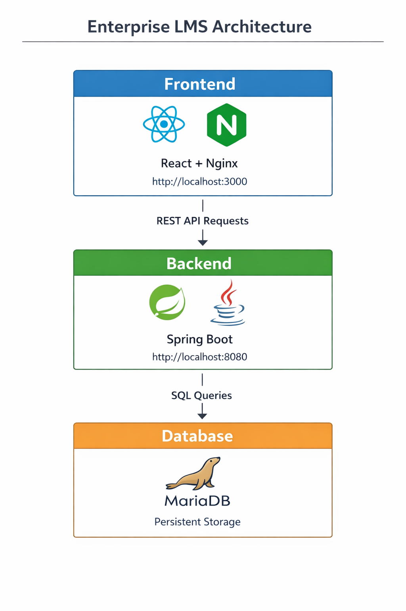

# Enterprise Learning Management System (LMS)
hi
A full-stack enterprise Learning Management System built using:

- React (Vite) frontend
- Spring Boot backend
- MariaDB database
- Docker containerized deployment

This system provides course enquiry management with persistent storage and real-time display.

---

# Features

## Frontend (React + Vite)

- Course enquiry form
- Submit enquiry
- Display enquiries immediately
- REST API integration
- Dockerized production build using Nginx

## Backend (Spring Boot)

- REST API for enquiry management
- MariaDB integration using Spring Data JPA
- Automatic database schema creation
- Production-ready Maven build
- Docker container support

## Database (MariaDB)

- Persistent storage
- Automatic table creation
- Docker volume support

## DevOps / Docker

- Multi-container architecture
- Backend container
- Frontend container
- MariaDB container
- Docker Compose orchestration

---

# System Architecture
React Frontend (Port 3000)
|
v
Spring Boot Backend (Port 8080)
|
v
MariaDB Database (Port 3307)


---

# Project Structure

---

# API Endpoints

## Save Enquiry

Request:

```json
{
  "name": "John",
  "email": "john@email.com",
  "phone": "9999999999",
  "course": "DevOps"
}
Request:

```json
{
  "name": "John",
  "email": "john@email.com",
  "phone": "9999999999",
  "course": "DevOps"
}
[
  {
    "id": 1,
    "name": "John",
    "email": "john@email.com",
    "phone": "9999999999",
    "course": "DevOps"
  }
][
  {
    "id": 1,
    "name": "John",
    "email": "john@email.com",
    "phone": "9999999999",
    "course": "DevOps"
  }
]
spring.datasource.url=jdbc:mariadb://mariadb:3306/lnd_db
spring.datasource.username=root
spring.datasource.password=root

spring.jpa.hibernate.ddl-auto=update
docker-compose build --no-cache
docker-compose up
Access Application

Frontend:

http://localhost:3000

Backend API:

http://localhost:8080/api/enquiries

MariaDB:

localhost:3307
Verify Database

Access MariaDB container:

docker exec -it lnd-mariadb mysql -uroot -proot lnd_db

Query:

SELECT * FROM enquiry;
Development Mode

Backend:

cd backend
mvn spring-boot:run

Frontend:

cd frontend
npm install
npm run dev
Technologies Used

Frontend:

React

Vite

Axios

JavaScript

Backend:

Spring Boot

Spring Data JPA

Maven

Java 17

Database:

MariaDB

DevOps:

Docker

Docker Compose

Nginx

Production Ready Features

Containerized deployment

Persistent database

RESTful API

Enterprise project structure

Scalable architectur


